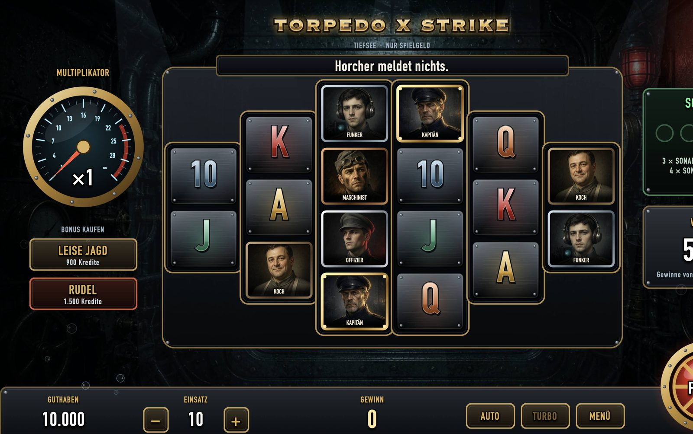
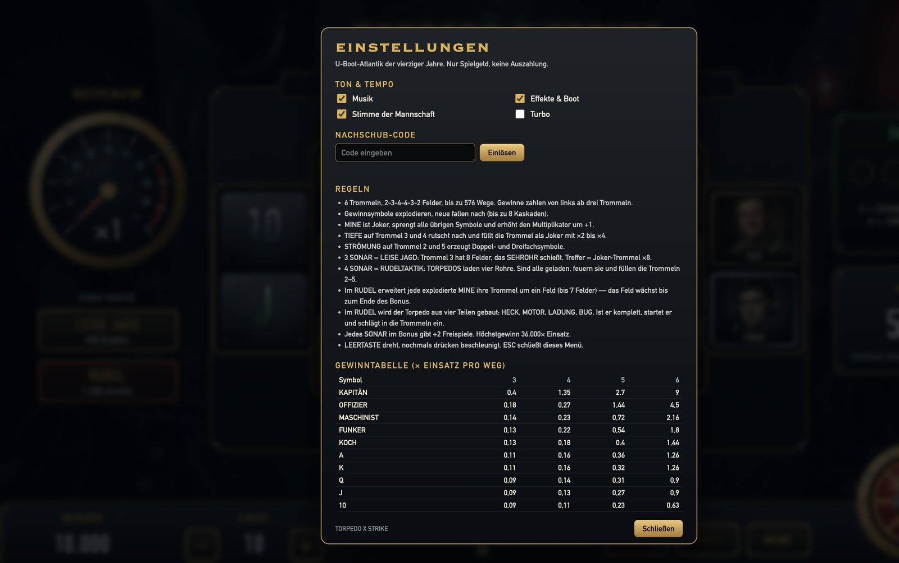
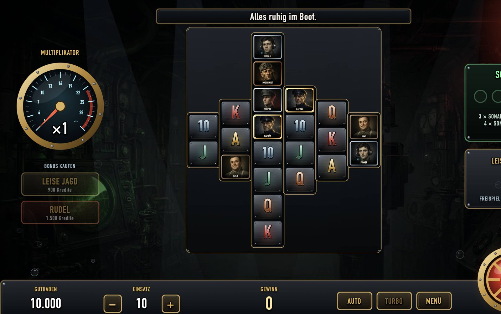
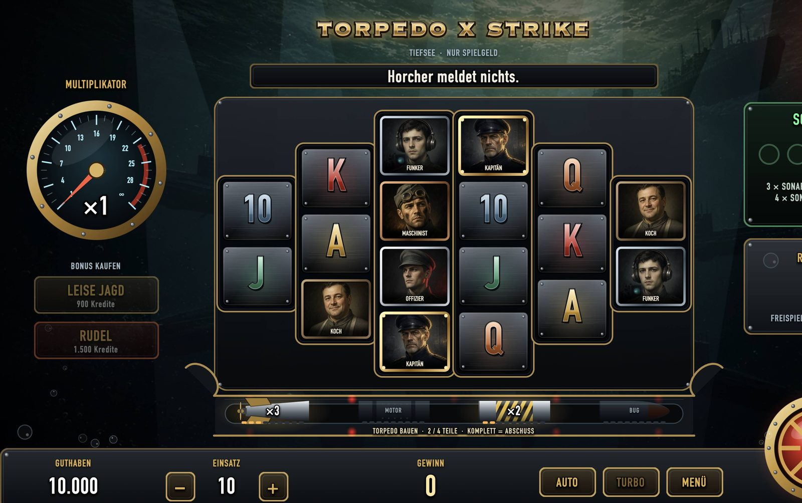
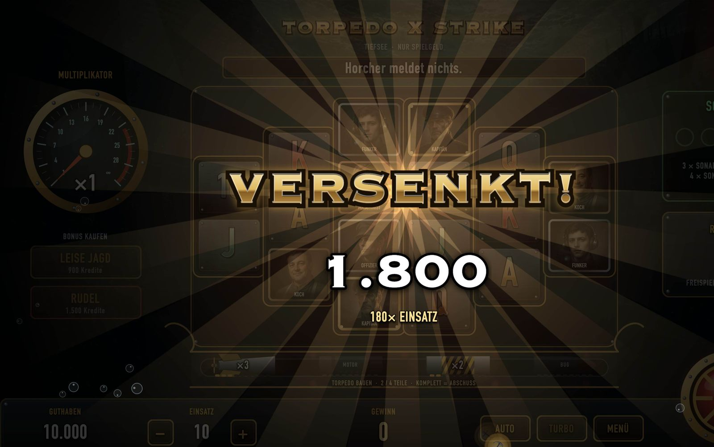

# Torpedo x Strike

Версия **2.2**

Настольное приложение для macOS: слот **Torpedo x Strike** в антураже подводной лодки. Шесть барабанов в форме 2-3-4-4-3-2, до 576 способов выигрыша, каскады, множитель и два бонусных режима. Интерфейс и реплики на немецком.

Это самостоятельная программа. Она не связана с казино, операторами азартных игр и коммерческими слотами.

Скачать можно только само приложение. Эта версия работает только на Mac.

Файл в репозитории: [Torpedo x Strike.app](https://github.com/MicKhon/Torpedo_Submarine_Slot/tree/main/Torpedo%20x%20Strike.app).

Как запустить:

1. Скачайте `Torpedo x Strike.app`.
2. Откройте его двойным щелчком.
3. Если macOS пишет, что разработчик не опознан, нажмите по файлу правой кнопкой и выберите «Открыть».

Windows и телефон эту сборку не запускают.

## Скриншоты

### Обычная игра



Шесть барабанов, счёт игровых кредитов, ставка и кнопка пуска. Сверху название Torpedo x Strike. Кредиты на экране не являются деньгами.

### Меню



Звук, правила и таблица выплат. Всё считается в игровых кредитах, выплаты наружу нет.

### Leise Jagd



Бонус тихой охоты: средний барабан становится выше, поле подстраивается под новые ряды. Справа видно, сколько бесплатных вращений осталось.

### Rudeltaktik



Бонус стаи. Под полем выезжает торпедная шахта. Части торпеды собираются в ней, по краям мигают лампы, крышки замыкают рамку аппарата.

### Крупный выигрыш



Если выигрыш большой относительно ставки, сумма считается на отдельном экране. Это по-прежнему игровые кредиты, а не выплата.

## Это не азартная игра и не казино

Программа сделана только для развлечения на своём компьютере.

- Используется **демонстрационный счёт**. Числа на экране — игровые кредиты.
- Кредиты **не являются деньгами**. У них нет стоимости, их нельзя купить, продать, вывести или обменять на деньги, призы, имущество или услуги.
- Нет приёма ставок, депозитов, платежей, выигрышей и выплат.
- Нет регистрации, личного кабинета, сервера ставок и связи с платёжными системами.
- Программа **не оказывает услуг азартных игр**, не является букмекерской конторой, лотереей, тотализатором или казино и не приглашает участвовать в таких играх.
- Автор **не занимается рекламой казино и слотов**. Программа не рекламирует игорные заведения, сайты казино, ставки на деньги и коммерческие игровые автоматы. Упоминание похожего жанра не является рекламой таких услуг.
- Баланс хранится только локально, в `localStorage` на этом Mac. Он никуда не отправляется.
- Внешний вид похож на игровой автомат, но это имитация. Результат вращения не создаёт денежного обязательства.

Законы об азартных играх в разных странах отличаются. Эта сборка не предназначена для приёма реальных ставок и не заменяет лицензию на игорную деятельность. Лицам младше 18 лет программа не предназначается, даже несмотря на отсутствие реальных денег.

## Возможности версии 2.2

- Базовая игра: выигрыши слева направо от трёх барабанов, каскады до 8 шагов, множитель на шкале.
- Особые символы: мина, глубина, течение, сонар.
- **Leise Jagd** — бонус на 8 бесплатных вращений. Третий барабан становится выше, перископ может дать множитель.
- **Rudeltaktik** — бонус на 8 бесплатных вращений. Под полем выезжает торпедный отсек. Торпеда собирается из четырёх частей и запускается, когда собрана. Поле на время этого бонуса немного уменьшается, затем возвращается к обычному размеру. В других режимах размер поля меняется только если на барабане становится больше рядов.
- Крупный выигрыш с несколькими ступенями показа.
- Ставка выбирается из фиксированного ряда. Покупка бонуса списывает только игровые кредиты.
- Звук: музыка, эффекты, голос. Их можно выключить в меню.
- Пробел запускает вращение, повторное нажатие его ускоряет. Есть турбо и автоигра.

Верхний предел показанного выигрыша в движке — 36 000× ставки. Это ограничение демо-математики, а не обещание выплаты.

## Стек

### Приложение

- macOS 14 и новее, Xcode, Swift.
- Окно и меню: SwiftUI.
- Сцена: `WKWebView` внутри `NSView`, который показывает SwiftUI.
- Страница открывается не с диска, а с локального адреса `http://127.0.0.1`. Небольшой HTTP-сервер на BSD-сокетах отдаёт файлы из ресурсов приложения. Слушает только этот компьютер.
- В `Info.plist` разрешена локальная сеть (`NSAllowsLocalNetworking`), чтобы WebKit мог открыть этот адрес.
- Идентификатор сборки: `com.local.torpedobay`. Подпись локальная, не для магазина.

### Игра в WebKit

- Язык интерфейса сцены: JavaScript.
- Графика: **PixiJS 8**, предпочтительно WebGL, с запасным холстом Canvas.
- Анимация: **GSAP 3**. Общая шкала времени ускоряет турбо и пропуск спина.
- Сборка страницы: **esbuild**. В приложение попадает один `game.js` в формате IIFE.
- Картинки символов и фонов: JPEG. Рамки, панели, торпеда, вспышки и частицы дорисовываются на canvas и становятся текстурами Pixi.
- Шрифты берутся из системы: DIN Condensed, DIN Alternate, Copperplate, Impact.

### Звук

- Музыка, шум моря, скрип корпуса и эффекты синтезируются через **Web Audio API**. Отдельного аудиофайла музыки нет.
- Голос: записанные короткие фразы в WAV и, где их нет, системный синтез речи `speechSynthesis` с немецким голосом.
- Громкость музыки приглушается на время громких эффектов.

### Математика и сохранение

- Правила барабанов, выплат, бонусов и лимита выигрыша описаны в `TorpedoBay/Web/src/engine.js`. Это детерминированный генератор от начального числа, без сетевого генератора случайных чисел.
- Баланс, ставка и переключатели звука пишутся в `localStorage` браузера внутри приложения. Сервера аккаунтов нет.

### Исходники

| Путь | Назначение |
| --- | --- |
| `TorpedoBay/TorpedoBayApp.swift` | Точка входа и показ окна |
| `TorpedoBay/UI/StageHost.swift` | WebKit и локальный сервер |
| `TorpedoBay/Web/index.html` | Страница и меню настроек |
| `TorpedoBay/Web/src/main.js` | Сцена, барабаны, бонусы |
| `TorpedoBay/Web/src/engine.js` | Математика демо-слота |
| `TorpedoBay/Web/src/audio.js` | Музыка и эффекты |
| `TorpedoBay/Web/src/art.js` | Текстуры, нарисованные в коде |
| `TorpedoBay/Web/game.js` | Готовый пакет для приложения |

Каталог `TorpedoBay/Engine` и часть файлов в `TorpedoBay/UI` — более ранний вариант на Swift. В версии 2.2 игра запускается из веб-сцены, эти файлы в окно не выводятся.

## Сборка

Нужны Xcode и macOS 14+.

Пакет страницы, если менялся JavaScript:

```bash
cd TorpedoBay/Web
esbuild src/main.js --bundle --outfile=game.js --format=iife --platform=browser --minify
```

Для этой команды рядом должны быть пакеты `pixi.js` и `gsap`. В самой игре они уже включены в `game.js`.

Приложение:

```bash
xcodebuild -project TorpedoBay.xcodeproj -scheme TorpedoBay -configuration Debug -destination "platform=macOS" build
```

Готовое приложение версии 2.2 лежит в репозитории: [Torpedo x Strike.app](https://github.com/MicKhon/Torpedo_Submarine_Slot/tree/main/Torpedo%20x%20Strike.app). Скачивать можно только его. Сборка только для Mac.

## Версия

Метка git: `v2.2`.

В проекте Xcode поле `MARKETING_VERSION` равно `2.2`. Название приложения: **Torpedo x Strike**.
